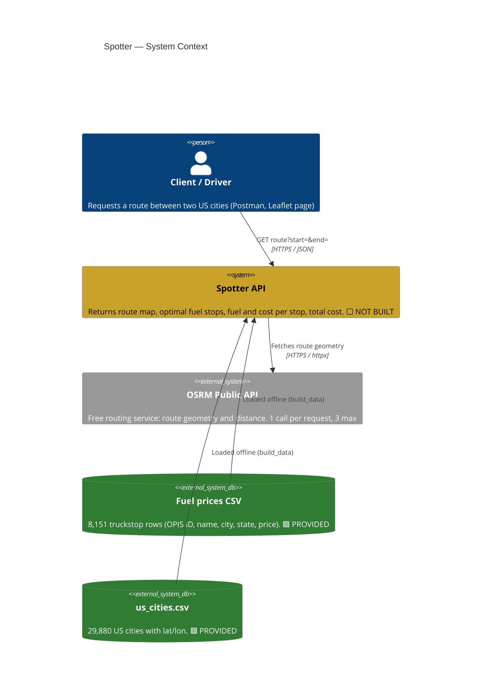
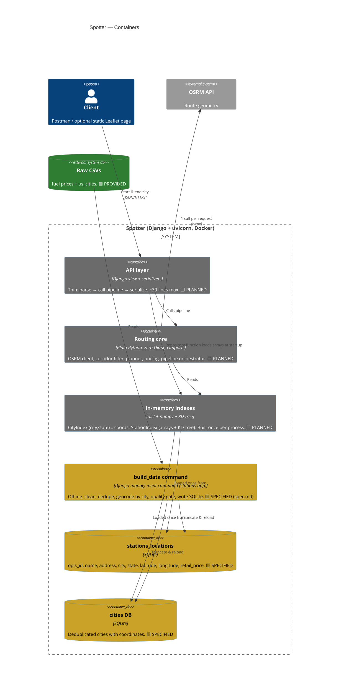
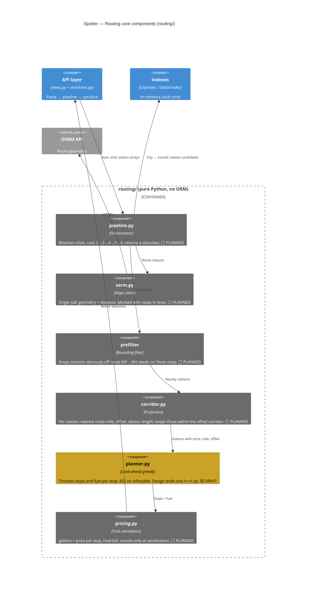

# Spotter — Fuel-Stop Route Planner

An API that takes a **start** and a **finish** city in the USA and returns the route map, the
**cost-optimal fuel stops** along it, the fuel bought and money spent at each stop, and the total
fuel bill. Latency is a first-class requirement: the expensive work (cleaning, geocoding, indexing)
happens offline or once per process, never per request.

> **Status: design-complete, implementation not started.** The constitution, architecture, first
> feature spec and raw data exploration exist. No Django project, routing code or tests exist yet.
> See [Project status](#project-status).

## Vehicle model

| Parameter | Value |
|---|---|
| Tank | 50 gal, starts **full** (that initial fuel is not billed) |
| Efficiency | 10 mpg |
| Minimum in tank | 1 gal, never empty |
| Detour reserve | `offset_mi × detour_legs × safety_factor / mpg` (10 mi × 2 × 1.5 / 10 = 3 gal) |
| Usable range | `(tank − reserve − minimum) × mpg` → **460 mi** between fill-ups with the defaults |

Detour miles are covered by the reserve and are excluded from consumption and from fuel billed.

## Fuel policy (look-ahead greedy)

At each station buy only enough to reach the **nearest cheaper** station within usable range. If none
is in range, fill the tank and drive to the cheapest reachable station. Ties break by lower route
mile, then lower detour, then lower OPIS ID (deterministic). If no station is within range the
request fails with **HTTP 422** and a machine-readable reason. The planner is to be validated against
exhaustive search on small random instances. Full rules: [constitution](fueling_map/.specify/memory/constitution.md).

## Architecture (C4)

Legend: 🟩 built (document/spec/data exists) · 🟨 specified, code not written · ⬜ planned, not yet specified.
Mermaid C4 renders natively on GitHub.

### Level 1 — System Context

### Level 2 — Containers

### Level 3 — Components of the Routing core

Request flow: `views → pipeline → (city lookup) → osrm ‖ prefilter → corridor → planner → pricing → serializer`.

## Project status

| Area | State | Where |
|---|---|---|
| Constitution v1.0.0 (principles, correctness rules, stack, governance) | ✅ Done | [`fueling_map/.specify/memory/constitution.md`](fueling_map/.specify/memory/constitution.md), draft in `drafts/constitution.md` |
| Architecture and data flow | ✅ Done | [`ARCHITECTURE.md`](ARCHITECTURE.md) |
| Agent safety rules and human gates | ✅ Done | [`CLAUDE.md`](CLAUDE.md) |
| Spec Kit scaffolding (skills, templates) | ✅ Done | `.claude/skills/`, `fueling_map/.specify/` |
| Raw data exploration | ✅ Done | `exploration.ipynb` |
| Feature 001 spec: `build_data` pipeline (4 user stories, 17 requirements, clarified) | ✅ Spec written | [`fueling_map/specs/001-build-data-pipeline/spec.md`](fueling_map/specs/001-build-data-pipeline/spec.md) |
| Feature 001 plan | 🟡 Unfilled template | `.../plan.md` |
| Feature 001 tasks | ❌ Not generated | run `/speckit-tasks` |
| Django project (`config/`, `stations/`, `api/`) | ❌ Not started | no code yet |
| `build_data` command and SQLite tables | ❌ Not started | |
| Routing core: OSRM client, corridor, planner, pricing, pipeline | ❌ Not started | greedy sketch in `v1.py` is non-runnable pseudocode |
| CityIndex / StationIndex | ❌ Not started | |
| API endpoint and serializers | ❌ Not started | |
| Tests (pytest, respx, brute-force planner check), ruff, mypy | ❌ Not started | |
| CI (GitHub Actions), Docker, Sentry | ❌ Not started | |
| Leaflet map page | ❌ Optional | |
| Postman check and demo video | ❌ Not started | |

### Suggested next steps

1. Fill `plan.md` for feature 001 (`/speckit-plan`), then `/speckit-tasks`.
2. Implement `build_data` in PRs of at most 300 lines.
3. Build the pure routing core against in-memory arrays (no DB needed to test it).
4. Wire the thin API view, then Docker and CI.

## Known limitations

- **City-level coordinates.** Stations are located at their city's coordinates, not their real
  position. To avoid stacking, all but one station per city are shifted deterministically by at most
  5 miles. This is a spreading heuristic, not a real location, so **reported costs are estimates, not
  quotes**.
- Names must come from `us_cities.csv`; no fuzzy matching (a misspelled city is reported in
  `unmatched.csv`). Cities in the 50 states plus DC only.
- Open items: exact terminal-leg billing (`TODO(TERMINAL_LEG)` in the constitution) and the CI config.

## Planned stack

Django (latest) · uv · uvicorn · httpx · SQLite · pytest, pytest-mock, respx · ruff, mypy · Docker · Sentry · GitHub Actions. OSRM supplies route geometry
([docs](https://project-osrm.org/docs/v5.24.0/api/#route-service)). No auth (MVP).

## Data

| File | Rows | Columns |
|---|---|---|
| `fuel-prices-for-be-assessment.csv` | ~8,150 | OPIS Truckstop ID, Truckstop Name, Address, City, State, Rack ID, Retail Price |
| `us_cities.csv` | ~29,880 | ID, STATE_CODE, STATE_NAME, CITY, COUNTY, LATITUDE, LONGITUDE |

## Working agreements

Spec Kit flow (specify → plan → tasks → implement); one logical change per PR, ≤300 lines;
conventional commits `type(scope): summary`; green ruff/mypy/pytest before review; the human approves
every push and merge. Details in the constitution and `CLAUDE.md`.
